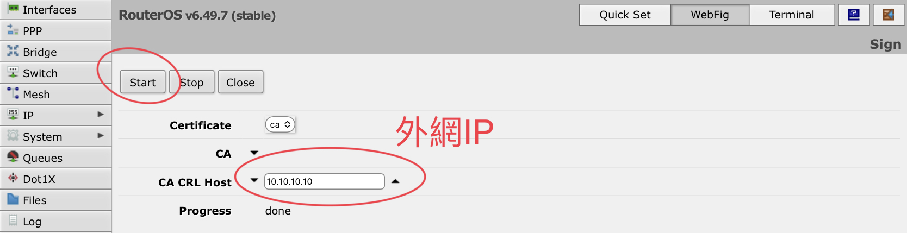
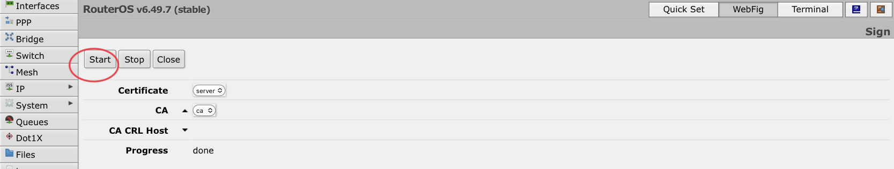
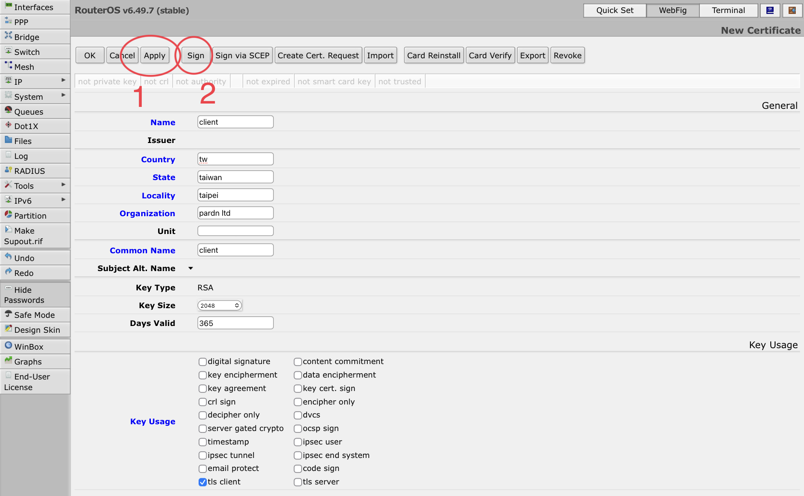

# Mikrotik OVPN Server

*RouterOS v6.49*

#### 1. 製作 ca.crt 並導出 ca.crt

```
/certificate add name=ca common-name=ca key-usage=key-cert-sign,crl-sign
/certificate sign ca name=ca ca-crl-host=[外網IP]
/certificate export-certificate ca file-name=ca
```





#### 2. 製作 server.crt

```
/certificate add name=server country=tw state=taiwan locality=taipei organization="pardn ltd" common-name=server key-usage=digital-signature,key-encipherment,tls-server
/certificate sign server name=sever ca=ca
```




#### 3. 製作 client.crt 並導出 client.crt, client.key

```
/certificate add name=client country=tw state=taiwan locality=taipei organization="pardn ltd" common-name=client key-usage=tls-client
/certificate sign client name=client ca=CA
/certificate export-certificate client file-name=client export-passphrase=[自訂密碼]
```




#### 4. 創建 Pool

```
/ip pool add name=dhcp-ovpn ranges=10.10.10.2-10.10.10.9
```


#### 5. 創建 Profile

```
/ppp profile add name=ovpn local-address=10.10.10.1 remote-address=dhcp-ovpn
```


#### 6. 設定 OVPN Server

```
/interface ovpn-server server set enabled=yes netmask=24 default-profile=ovpn certificate=server cipher=aes256
```


#### 7. 建立 OVPN 密碼

```
/ppp secret add name=[帳號] password=[密碼] service=ovpn profile=ovpn
```


#### 8. 確認 Firewall Port 1194（若無法連接VPN）

```
/ip firewall filter add chain=input protocol=tcp dst-port=1194 action=accept 
```


#### 9. 確認 Nat（若連上後無法上網）


#### 10. 下載 ca.crt, client.crt, client.key


#### 11. 新增文字檔並儲存成 .ovpn 副檔名

```
[連線名稱]
dev tun
proto tcp-client
remote [外網IP] 1194
keepalive 10 120
auth SHA1
cipher AES-256-CBC
data-ciphers AES-256-CBC
verb 5
redirect-gateway def1
dhcp-option DNS 8.8.8.8
auth-user-pass
tls-client
client
remote-cert-tls server

<ca>
[ca.crt 內容]
</ca>

<cert>
[client.crt 內容]
</cert>

<key>
[client.key 內容]
</key>
```

#### 12. 導入 .ovpn


